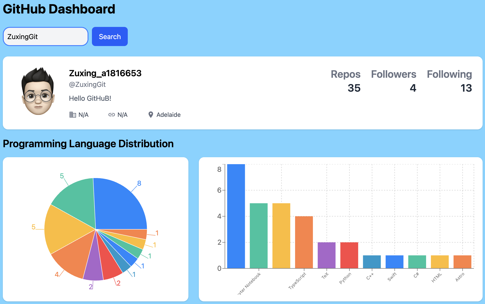
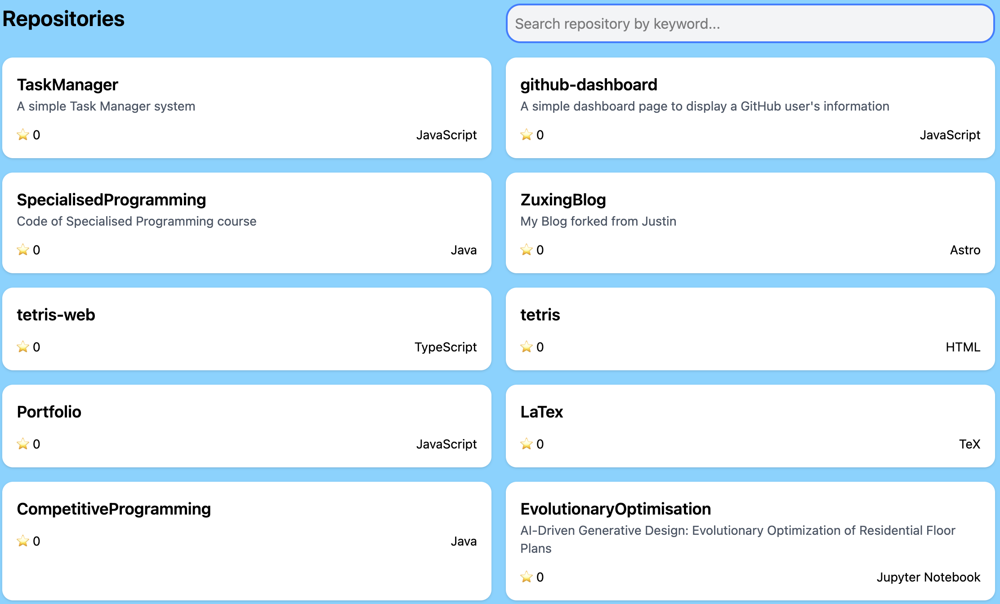

# GitHub Dashboard
**A simple dashboard page to display a GitHub user's information, including profile details, followers, programming languages distribution, and repositories.**

## Live Demo
You can view a live demo of the GitHub Dashboard here: https://github-dashboard-zuxing.netlify.app

## Features
- **User Profile**: Displays the user's avatar, name, bio, location, and key statistics (public repositories, followers, following).  
  
- **Languages**: Visualizes the distribution of programming languages used in the user's repositories.
- **Repositories**: Lists the user's repositories with details such as name, description, star count, and main programming language, orders them by recently updated.  
  
- **Filtering**: Allows filtering repositories by keywords.

## Technologies Used
- **React**: For building the user interface.
- **Tailwind CSS**: For styling the components.
- **GitHub API**: To fetch user data and repositories.  
&emsp;`https://api.github.com/users/{username}`  
&emsp;`https://api.github.com/users/{username}/repos`
- **recharts**: For rendering the language distribution chart.
